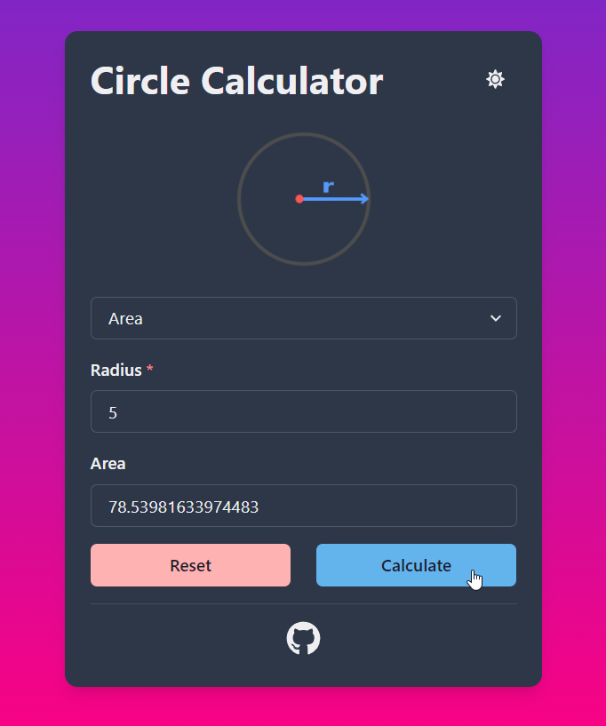

# Circle Calculator
Simple frontend app that works as a circle calculator. [Try it here!](https://circlecalculator.netlify.app/)

## Table of Contents
* [General Info](#general-information)
* [Features](#features)
* [Usage](#usage)
* [Screenshots](#screenshots)
* [Technologies Used](#technologies-used)
* [Setup](#setup)
* [To do](#to-do)

## General Information
This app is intended to give a friendly user interface for calculating the functions of a circle. It uses a responsive design for achieving compatibility on different screen sizes and supports light-dark theme switching to reduce eye strain when the screen is under different lighting conditions.

## Features
- Calculate area, circumference and diameter of a circle
- Dark theme switcher

## Usage
1. Select an option from the dropdown list
2. Input radius's value (A non negative number)
3. Click the "Calculate" button to get the result
4. Click the "Reset" button if you wish to reset all the values
5. Click the button in the top right corner if you wish to toggle dark theme

## Screenshots

## Technologies Used
- ReactJS - version 18.2.0
- Chakra UI - version 2.2.4
- NodeJS - version 16.14.2
- Netlify - hosting

## Setup
If you wish to run the project in a local environment you need [Node](https://nodejs.org/) installed in your computer. Version 16.14.2 is the one used for this project.
- Clone the repository on a local directory
- Open the directory on a terminal and run the command `npm install` to ensure all the dependencies are downloaded
- Run the command `npm start` to run the app in development mode

## To do:
- Unit tests
- Fix bug: Option value resetting after calculation
- Add typescript
- Dockerize app

